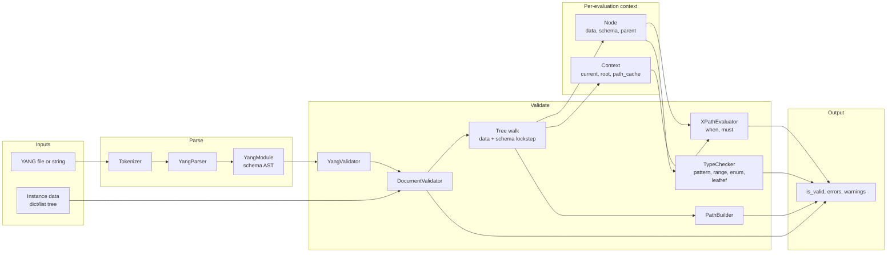

# Data flow during YANG validation

This document describes the high-level data streams involved when validating instance data against a YANG schema in xYang.

## Overview

Validation has two main inputs—**schema** (from a YANG module) and **instance data** (a tree of values)—and one output: **validation result** (success or a list of errors/warnings). Internally, schema and data are walked in lockstep while constraints are evaluated.

## Data flow diagram

## Streams in detail

| Stream | Description |
|--------|-------------|
| **YANG → AST** | YANG source (file or string) is tokenized, then parsed into a `YangModule` (schema AST). The AST carries typedefs, groupings, and the tree of containers/lists/leaves with `must`, `when`, `type`, etc. |
| **Instance data** | A single tree (dict/list) passed to `YangValidator.validate(data)`. Typically produced from YAML or JSON. Not modified; effective values (e.g. defaults) are computed on read. |
| **Schema + data in lockstep** | `DocumentValidator` walks the data tree and the schema tree together. For each data node it has the corresponding schema node (and parent chain), so it can evaluate `when`, `must`, and type constraints. |
| **Context and Node** | For each step, a `Node(data, schema, parent)` is the evaluation cursor; `Context(current, root, path_cache)` fixes the “current” node and root for XPath. Both are passed into the XPath evaluator and used for `current()`, `deref()`, and path resolution. |
| **XPath** | The `XPathEvaluator` evaluates `when` and `must` expressions. It uses `Context` and `Node` to resolve paths and `deref()`; optional `path_cache` reuses path results. |
| **Type checking** | `TypeChecker` applies pattern, range, length, enum, and leafref (with optional require-instance). It uses the schema type and the current value. |
| **Errors** | Structural (mandatory, cardinality, unknown fields), `when`/`must` failures, and type/leafref violations are collected as `ValidationError` and returned. `YangValidator.validate()` returns `(is_valid, errors, warnings)`. |

## Order of checks per node

Per RFC 7950 Section 8.1, applicability is determined first: mandatory and min/max-elements are enforced only when the node (and its ancestors) are applicable, i.e. when `when` and `if-feature` evaluate to true. So **when** must be evaluated before structural constraints (otherwise a present-but-inapplicable node could incorrectly get a min-elements error instead of a when-false error). The spec order is:

1. **when** (and **if-feature**) — If the node is present and `when` (or `if-feature`) is false, report error; node must not exist. If absent and when false, node is inapplicable — skip mandatory/min-elements for it.
2. **Structural** — mandatory, min/max-elements, presence; keys and choice (at most one case). Effective value and (Context, Node) are established here for the node.
3. **must** — evaluated in current node context (per entry for lists/leaf-lists).
4. **Type** — pattern, range, length, enum, leafref (with schema-aware resolution).
5. **Descend** — recurse into children.

`DocumentValidator._visit_stmt` follows this order: it builds the child’s effective value and a `Node`/`Context` for XPath (via `_effective_value` and `parent_node.step`), evaluates **`when` first**, then calls **`_check_structural`** (mandatory, min/max-elements, presence), then `must`, type, and descent. So error ordering for a single statement matches the spec intent (e.g. when-false before min-elements on the same node). Choice/case handling in `_visit_choice` similarly evaluates choice- and case-level `when` before mandatory-choice and branch validation.

## Related code

- **Entry:** `xyang.YangValidator`, `xyang.parse_yang_file` / `parse_yang_string`
- **Schema:** `xyang.module.YangModule`, `xyang.parser.yang_parser.YangParser`
- **Validation:** `xyang.validator.document_validator.DocumentValidator`, `_visit_children` / `_visit_stmt`
- **XPath:** `xyang.xpath.evaluator.XPathEvaluator`, `xyang.xpath.node.Context` / `Node`
- **Types:** `xyang.validator.type_checker.TypeChecker`, `xyang.xpath.schema_nav.SchemaNav`
